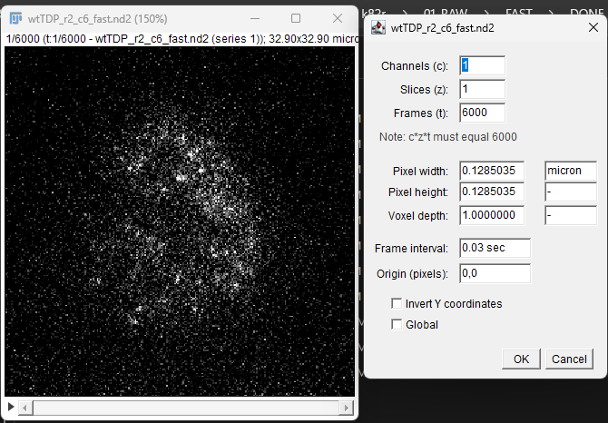
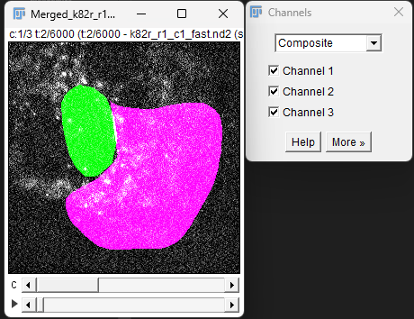
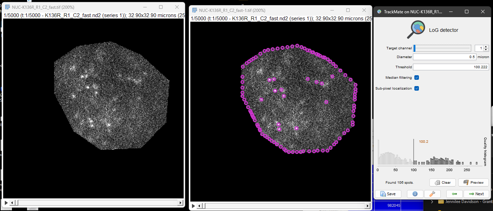
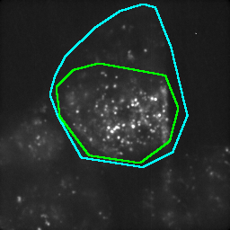

# Detailed Notes on Single Particle Tracking Analysis

### Introduction and scope

This is a space to write my documentation\notes on the analysis process which goes from raw time series .nd2 files to tracking spots, through to population analysis and statistics. It was mostly typed by me, though I had to use some LLM input for some markdown formatting. 

## Table of contents
| Task | Program | Comments |
| :--- | :--- | :--- |
| [1. Confirming Framerate](#1-confirming-framerate-from-metadata-pedandic-note) | ImageJ | Optional - macro provided |
| [2. Building Compartment Masks](#2-building-compartment-masks) | ImageJ | Macro provided |
| [3. Tracking particles](#3-tracking-particles-with-trackmate) | ImageJ |TrackMate Plugin |
| [4. Preprocessing csv files](#4-preprocessing-csv-files) | Python | Jupyter notebook |
| [5. Track analysis](#5-track-analysis) | fastspt  | Jupyter notebook |
| [6. Statistics](#6-Statistics)|Graphpad Prism|Nested analysis

## 1. Confirming Framerate from metadata
<details>
Why?
The raw image time series are .nd2 files. Imagej Properties report the framerate as 0.03 seconds (30msec) likely due to rounding. While the acquisition software took 30 msec exposures, it still takes time for the hardware to write the data.  By looking at the timestamps of each frame within the image meta data we can confirm the true framerate is 35 msec. This is important to get right for accurate diffusion estimates later (15% error between 30 and 35msec).  



*Fig 1. don't mistake the exposure time for frame interval for very fast frame intervals*

The following macro will investigate the metadata directly and look at the average delta time (dt) between frames 

```js
// Extracts all DeltaT values, calculates average and jitter
run("Bio-Formats Macro Extensions");

path = getInfo("image.directory") + getInfo("image.filename");
if (path == "") {
    exit("Error: Could not find the file path. Is the image saved on your drive?");
}

Ext.setId(path);
Ext.getImageCount(count);

intervals = newArray(count-1);
sum = 0;

for (i = 0; i < count-1; i++) {
    Ext.getPlaneTimingDeltaT(t1, i);      // <-- fixed
    Ext.getPlaneTimingDeltaT(t2, i+1);    // <-- fixed
    diff = t2 - t1;
    intervals[i] = diff;
    sum += diff;
}

avg = sum / (count-1);

sqSum = 0;
for (i = 0; i < intervals.length; i++) {
    sqSum += (intervals[i] - avg) * (intervals[i] - avg);
}
stdDev = sqrt(sqSum / intervals.length);

print("--- Accuracy Report for: " + getInfo("image.filename") + " ---");
print("Total Frames analyzed: " + count);
print("True Average Interval (dt): " + d2s(avg, 6) + " s");
print("Hardware Jitter (StdDev): " + d2s(stdDev, 9) + " s");
print("---------------------------------------");
if (stdDev > 0.001) {
    print("WARNING: High jitter detected (>1ms). Check PC background tasks.");
} else {
    print("STATUS: Stable acquisition. High confidence for Spot-On.");
}
```

Running this will show this output in the log:
```
--- Accuracy Report for: K136R_R1_C2_fast.nd2 ---
Total Frames analyzed: 6000
True Average Interval (dt): 0.034493 s
Hardware Jitter (StdDev): 0.000000005 s
---------------------------------------
```


</details>

## 2. Building Compartment Masks
<details>
Why? - creating a mask label for nuclear and cytoplasmic cell compartments is advantageous because it allows us to limit track detection. Tracks may be filtered post-hoc based on which compartment they reside in - you only need to do the analysis on the raw data once. Any tracks which change compartments could also be detected this way. The downside is that these are big timeseries. 6000 frames at 16-bit depth with 3 channels of 256x256 pixels is over 2 gig per stack. 




### Previous k136r analysis notes
<details>
In the previous analysis - nuclear or cytoplasmic compartments were directly cropped by setting pixels outside the compartment to 0. In my opinion, this is inappropriate for two reasons:

1. It will directly mess with the detection of point spread functions during any sort of downstream analysis - possibly not in the matlab based detection of point spread functions, but certainly for TrackMate. 



*Fig 2. Here is an example - when using TrackMate LOG detector for point spread functions, the sudden dropoff between the background noise and pixel values falling to 0 are false positives*

 

2. It is also an inelegant appreach duplicating raw data and needing to run two sets of analysis if there are two compartments.

To save me from having to redo a lot of work, I can recover the compartments masks by opening the raw image, locating the corresponding compartment cropped images, and creating mask channels from them by thresholding all pixels above 1. and then adding those to the raw image. 

**Important note, I've done a rolling ball background subtraction on the images with pixel radius 20 to help seperate noise from background for TrackMate step, so these are no longer 'raw' images**

```js
// Strategy: Raw (C1), Nuc Mask (C2), Cyto Mask (C3)
// Visuals: Cyan outline for Cytoplasm, Green outline for Nucleus

inputDir  = getDirectory("1. Select folder with RAW images (.nd2 or .tif)");
nucDir    = getDirectory("2. Select folder containing NUCLEAR masks");
cytoDir   = getDirectory("3. Select folder containing CYTOPLASMIC masks");
outputDir = getDirectory("4. Select folder to SAVE merged images");

list = getFileList(inputDir);
setBatchMode(true);

for (i = 0; i < list.length; i++) {
    if (endsWith(list[i], ".nd2") || (endsWith(list[i], ".tif") && indexOf(list[i], "Merged") == -1)) {

        // 1. Open Raw and get metadata
        run("Bio-Formats Importer", "open=[" + inputDir + list[i] + "] color_mode=Default view=Hyperstack stack_order=XYCZT");
        rawID    = getImageID();
        rawTitle = getTitle();
        getDimensions(w, h, c, s, f);
        totalFrames = Math.max(s, f);

        // Subtract background
        run("Subtract Background...", "rolling=20 stack");

        // Inherit spatial calibration directly from Bio-Formats metadata
        getVoxelSize(vw, vh, vd, vunit);

        baseName = replace(list[i], ".nd2", "");
        baseName = replace(baseName, ".tif", "");

        // 2. Locate mask files — skip with warning if either is missing
        nucPath = nucDir + "NUC-" + baseName + ".tif";
        if (!File.exists(nucPath)) nucPath = nucDir + "NUC-" + baseName + "_fast.tif";

        cytoPath = cytoDir + "CYTO-" + baseName + ".tif";
        if (!File.exists(cytoPath)) cytoPath = cytoDir + "CYTO-" + baseName + "_fast.tif";

        if (!File.exists(nucPath) || !File.exists(cytoPath)) {
            print("SKIPPED (mask missing): " + list[i]
                  + "\n  nuc  -> " + nucPath
                  + "\n  cyto -> " + cytoPath);
            close(rawTitle);
            continue;
        }

        nucTitle  = processStackMask(nucPath,  "NucMask",  w, h, totalFrames);
        cytoTitle = processStackMask(cytoPath, "CytoMask", w, h, totalFrames);

        // 3. Build edge stacks BEFORE merge — Merge Channels closes its inputs
        //    so NucMask and CytoMask will not exist after step 4.

        // --- Cyto edge stack (Cyan) ---
        selectWindow("CytoMask");
        run("Duplicate...", "duplicate");
        rename("CytoEdges");
        selectWindow("CytoEdges");
        run("Find Edges", "stack");
        run("Cyan");

        // --- Nuc edge stack (Green) ---
        selectWindow("NucMask");
        run("Duplicate...", "duplicate");
        rename("NucEdges");
        selectWindow("NucEdges");
        run("Find Edges", "stack");
        run("Green");

        // 4. Merge Channels (consumes rawTitle, nucTitle, cytoTitle)
        run("Merge Channels...", "c1=[" + rawTitle + "] c2=[" + nucTitle + "] c3=[" + cytoTitle + "] create");
        mergedID = getImageID();

        // 5. Stamp edge overlays onto merged stack frame by frame
        //for (t = 1; t <= totalFrames; t++) {
            selectImage(mergedID);
            //Stack.setFrame(t);
            run("Add Image...", "image=CytoEdges x=0 y=0 opacity=100 zero");
            run("Add Image...", "image=NucEdges x=0 y=0 opacity=100 zero");
        //}
        close("CytoEdges");
        close("NucEdges");

        // 6. Set View & Properties
        selectImage(mergedID);
        Stack.setActiveChannels("100");
        run("Properties...", "channels=3 slices=1 frames=" + totalFrames + " unit=" + vunit + " pixel_width=" + vw + " pixel_height=" + vh + " voxel_depth=1.0000 frame=[0.034493 sec]");

        // 7. Save
        saveAs("Tiff", outputDir + "Merged_" + baseName + ".tif");
        run("Close All");
    }
}

setBatchMode(false);
print("Done: all files merged with boundary overlays.");

// --- Helper: open mask, binarise, ensure 16-bit at target dimensions/frames ---
function processStackMask(path, newName, w, h, f) {
    open(path);
    run("16-bit");
    setThreshold(1, 65535);
    run("Convert to Mask", "method=Default background=Dark black stack");
    run("16-bit");
    rename(newName);
    return getTitle();
}

```


</details>


These ImageJ marcos will be useful to 
1. Interactively draw each compartment mask using the standard deviation projection of the time series' stack and then saves a 2-channel binary mask image. 
2. open each raw image, match it to the masks and expand the masks to the full depth of the stacks.

 **Important note, I've done a rolling ball background subtraction on the images with pixel radius 20 to help seperate noise from background for TrackMate step, so these are no longer 'raw' images**

 ```js
// =============================================================
//  SMT MASK DRAW + MERGE  —  Two-phase macro
//
//  PHASE 1  (run first, interactive)
//    Opens each *_Stdev.tif from 02_STD_DEV_PROJECTIONS/FAST,
//    waits for the user to draw NUC then CYTO ROIs,
//    saves a 2-channel binary mask to 03_MASKS as:
//        baseName_masks.tif   (C1 = Nuc, C2 = Cyto)
//
//  PHASE 2  (run after all masks are drawn, batch)
//    Opens each raw .nd2 / .tif from 01_RAW/FAST,
//    matches it to its _masks.tif,
//    expands the 2-D masks to full-depth stacks,
//    merges + stamps cyan/green boundary overlays,
//    saves to 04_MASK_MERGE_AND_BGROUNDSUBTRACT as:
//        Merged_baseName.tif
// =============================================================


// =============================================================
//  PHASE 1 — Interactive: draw NUC and CYTO compartments
// =============================================================
macro "Phase 1 - Draw Compartment Masks" {

    projDir = getDirectory("Select 02_STD_DEV_PROJECTIONS/FAST folder");
    maskDir = getDirectory("Select 03_MASKS folder (save destination)");

    list = getFileList(projDir);
    roiManager("reset");

    for (i = 0; i < list.length; i++) {
        fname = list[i];
        if (!endsWith(fname, "_std_dev.tif")) continue;

        baseName  = replace(fname, "_std_dev.tif", "");
        maskPath  = maskDir + baseName + "_masks.tif";

        // Skip files already processed
        if (File.exists(maskPath)) {
            print("SKIPPING (mask exists): " + baseName);
            continue;
        }

        // --- Open projection ---
        open(projDir + fname);
        projTitle = getTitle();
        getDimensions(w, h, c_dim, s_dim, f_dim);
        run("Grays");
        run("Enhance Contrast", "saturated=0.35");
        setTool("polygon");
        run("Remove Overlay");

        // ---- NUCLEUS ----
        roiManager("reset");
        waitForUser("NUCLEUS  [" + baseName + "]",
            "Draw the NUCLEAR boundary on the image, then click OK.");
        if (selectionType() == -1) {
            print("WARNING: no selection made for NUC — skipping " + baseName);
            close(projTitle);
            continue;
        }
        roiManager("Add");

        newImage("NucMask", "8-bit black", w, h, 1);
        roiManager("Select", 0);
        setForegroundColor(255, 255, 255);
        run("Fill", "slice");
        run("Select None");
        run("16-bit");
        roiManager("reset");

       // ---- CYTOPLASM ----
        selectWindow(projTitle);
        setTool("freehand");
        waitForUser("CYTOPLASM  [" + baseName + "]",
            "Draw the CYTOPLASMIC boundary on the image, then click OK.\n" +
            "(Draw whole cell outline OR a ring — your choice per cell.)");
        if (selectionType() == -1) {
            print("WARNING: no selection made for CYTO — skipping " + baseName);
            close(projTitle);
            close("NucMask");
            continue;
        }
        roiManager("Add");
        newImage("CytoMask", "8-bit black", w, h, 1);
        roiManager("Select", 0);
        setForegroundColor(255, 255, 255);
        run("Fill", "slice");
        run("Select None");
        // Morphological close to fill gaps in drawn boundary
        run("Close-");
        run("16-bit");
        roiManager("reset");
        // Subtract nuclear region so no pixel belongs to both masks
        imageCalculator("Subtract", "CytoMask", "NucMask");

        // ---- Merge to 2-channel mask image and save ----
        // c1 = Nuc (red LUT for identification), c2 = Cyto (green LUT)
        // The LUT choice here is cosmetic only; split in Phase 2 uses channel order.
        run("Merge Channels...", "c1=NucMask c2=CytoMask create");
        rename("Masks_" + baseName);
        saveAs("Tiff", maskPath);

        run("Close All");
        roiManager("reset");
        print("Saved: " + baseName + "_masks.tif");
    }

    print("=== Phase 1 complete ===");
}


// =============================================================
//  PHASE 2 — Batch: merge raw stacks with drawn masks
// =============================================================
macro "Phase 2 - Merge Raw Stacks with Masks" {

    rawDir    = getDirectory("Select 01_RAW/FAST folder");
    maskDir   = getDirectory("Select 03_MASKS folder");
    outputDir = getDirectory("Select 04_MASK_MERGE_AND_BGROUNDSUBTRACT folder");

    list = getFileList(rawDir);
    setBatchMode(true);

    for (i = 0; i < list.length; i++) {
        fname = list[i];

        // Accept .nd2 or .tif, skip any already-merged files
        if (!endsWith(fname, ".nd2") && !endsWith(fname, ".tif") && !endsWith(fname, ".tiff")) continue;
        if (indexOf(fname, "Merged") != -1) continue;

        baseName   = replace(fname, ".nd2", "");
        baseName   = replace(baseName, ".tiff", "");
        baseName   = replace(baseName, ".tif", "");
        maskPath   = maskDir   + baseName + "_masks.tif";
        outputPath = outputDir + "Merged_" + baseName + ".tif";

        if (!File.exists(maskPath)) {
            print("SKIPPED (no mask found): " + baseName);
            continue;
        }
        if (File.exists(outputPath)) {
            print("SKIPPING (output exists): " + baseName);
            continue;
        }

        // --- 1. Open raw stack via Bio-Formats ---
        run("Bio-Formats Importer",
            "open=[" + rawDir + fname + "] color_mode=Default view=Hyperstack stack_order=XYCZT");
        rawID    = getImageID();
        rawTitle = getTitle();
        getDimensions(w, h, c_dim, s_dim, f_dim);
        totalFrames = maxOf(s_dim, f_dim);

        // Read frame interval from embedded metadata (seconds)
        frameInterval = Stack.getFrameInterval();

        //photobleach correction
        run("Bleach Correction", "correction=[Exponential Fit]");

        // Subtract background
        run("Subtract Background...", "rolling=20 stack");

        // Inherit spatial calibration
        getVoxelSize(vw, vh, vd, vunit);

        // --- 2. Open 2-channel mask and split ---
        open(maskPath);
        maskTitle = getTitle();
        run("Split Channels");
        nucSingleTitle  = "C1-" + maskTitle;
        cytoSingleTitle = "C2-" + maskTitle;

        // --- 3. Build single label mask: Cyto=1, Nuc=2 ---
        // Masks are 16-bit with filled pixels at 255
        selectWindow(cytoSingleTitle);
        run("Divide...", "value=255");   // → 0 or 1
        rename("LabelMask");

        selectWindow(nucSingleTitle);
        run("Divide...", "value=255");   // → 0 or 1
        run("Multiply...", "value=2");     // → 0 or 2
        rename("NucLabel");

        imageCalculator("Add", "LabelMask", "NucLabel");
        close("NucLabel");
        // LabelMask is now: 0=bg, 1=cyto, 2=nuc
		selectWindow("LabelMask");
		
		
        // --- 4. Build edge overlays for QC (before expand consumes LabelMask) ---
        selectWindow("LabelMask");
        run("Duplicate...", "title=CytoEdgeSrc");
        selectWindow("CytoEdgeSrc");
        setThreshold(1, 1);
        run("Convert to Mask");
        run("Find Edges");
        run("Cyan");
        rename("CytoEdges");

        selectWindow("LabelMask");
        run("Duplicate...", "title=NucEdgeSrc");
        selectWindow("NucEdgeSrc");
        setThreshold(2, 2);
        run("Convert to Mask");
        run("Find Edges");
        run("Green");
        rename("NucEdges");

        // --- 5. Expand label mask to full-depth stack ---
        expandToStack("LabelMask", totalFrames, "LabelStack");

         // --- 6. Merge channels ---
        run("Merge Channels...",
            "c1=[" + rawTitle + "] c4=[LabelStack] create");
        mergedID = getImageID();

        // --- 6b. Stamp edge overlays ---
        selectImage(mergedID);
        run("Add Image...", "image=CytoEdges x=0 y=0 opacity=100 zero");
        run("Add Image...", "image=NucEdges  x=0 y=0 opacity=100 zero");
        close("CytoEdges");
        close("NucEdges");

        // --- 7. Set stack properties ---
        selectImage(mergedID);
        Stack.setActiveChannels("10");
        run("Properties...",
            "channels=2 slices=1 frames=" + totalFrames +
            " unit=" + vunit +
            " pixel_width=" + vw +
            " pixel_height=" + vh +
            " voxel_depth=1.0000" +
            " frame=[" + frameInterval + " sec]");

        

        // --- 8. Save ---
        saveAs("Tiff", outputPath);
        run("Close All");
        print("Done: " + baseName);
    }

    setBatchMode(false);
    print("=== Phase 2 complete ===");
}


// =============================================================
//  Helper: expand a single-frame image into an nFrames stack.
//  Closes the source window; leaves newName as the active image.
// =============================================================
function expandToStack(sourceTitle, nFrames, newName) {
    selectWindow(sourceTitle);
    w = getWidth();
    h = getHeight();
    sourceID = getImageID();

    // Create a blank stack at the target depth
    newImage(newName, "16-bit black", w, h, nFrames);
    stackID = getImageID();

    // Copy the single frame into every slice of the new stack
    for (t = 1; t <= nFrames; t++) {
        selectImage(sourceID);
        run("Select All");
        run("Copy");
        selectImage(stackID);
        setSlice(t);
        run("Paste");
    }
    run("Select None");

    // Close the (now redundant) single-frame source
    selectImage(sourceID);
    close();

    selectWindow(newName);
}

```

</details>

Now all images are ready for the next step of trackmate processing. They are 3 channel images, 
1. Flourescent data 
2. Nuclear mask 
3. Cytoplasm mask

(This dataset should be copied to a local HDD for faster processing.)

## 3. Tracking particles with TrackMate

[TrackMate GitHub](https://github.com/trackmate-sc/TrackMate)
<details>


Why? This is where we will detect the moving point spread functions and output a master table to use for spot-on.  It is crticial to have meaningful and transparant detection paramters here which is why I'm taking the time to document (and will draft the corresponding manuscript section for the methods from this)

### TrackMate Analysis Quick Parameters Summary
| Category | Parameter | Value | Comment |
| :--- | :--- | :--- | :--- |
| **Image Geometry** | Dimensions (Crop) | 153 x 181 pixels | Limited to cell body ROI,  by first c |
| | Frame Interval (dt) | 0.034493 s | Read from metadata|
| | Pixel Size (dx, dy) | 0.1285 µm |Read from metadata|
| | Total Frames | 6,000 |Read from metadata|
| **Detector (LoG)** | Target Channel | 1 | Fluorescent channel. |
| | Subpixel Localization | Enabled (True) | 2D Gaussian fitting to achieve precision beyond the physical pixel limit. |
| | Median Filtering | Enabled (True) | Further pre-processing to remove remaining background noise before detection. |
| | Estimated Radius | 0.25 µm | Matches the expected diffraction-limited size of a single PSF. |
| | Threshold | 63.287 | **Picked by eye to balance sensitivity vs. false positive detections.** |
| **Tracker (LAP)** | Tracker Type | Simple LAP | Efficient for Brownian or near-Brownian motion without complex branching. |
| | Linking Max Distance | 0.7 µm | Captures 99th percentile at D_free ≈ 0.5 µm²/s. Tighter values might truncate fast jumps and bias D_free downward. |
| | Gap Closing Max Dist | 0.9 µm | Over 2×Δt (1 frame gap), 99th percentile at D ≈ 0.5 is ~0.8 µm. |
| | Max Frame Gap | 1 frame | Rescues split track detections without introducing ambiguous links. |
| | Gap Closing | Enabled | |
| | Splitting / Merging | Disabled | Simplifies analysis by assuming particles do not physically fuse or divide. |
| **Filters** | Spot Quality Filter | > 70 | **Picked by eye — eliminates dim, non-specific background fluctuations from the dataset.** |
| | Min Track Duration | 0.068 s | 3 detections (2 jumps). Lowest reliable threshold — higher values selectively filter out fast molecules and would inflate F_bound as only bound trajectories would have such long lasting tracks. |

This code might be useful for individually running an image with trackmate. It will grab the cell outline by combining each mask. and then open trackmate:

```js
if (roiManager("count") > 0) {
    roiManager("deselect");
    roiManager("delete");
}
title=getTitle();
Stack.setActiveChannels("100");
run("Grays");
run("Enhance Contrast", "saturated=0.35");
run("Remove Overlay");
run("Select None");
run("Duplicate...", "duplicate channels=2-3 frames=1");
run("Split Channels");
close;
close;
run("Duplicate...", "title=cellroi duplicate channels=2-3 frames=1");
run("Split Channels");
imageCalculator("Add create", "C1-cellroi","C2-cellroi");
selectImage("Result of C1-cellroi");
setOption("BlackBackground", true);
run("Convert to Mask");
run("Create Selection");
roiManager("Add");
selectImage("C2-cellroi");
close;
selectImage("C1-cellroi");
close;
selectImage("Result of C1-cellroi");
close;
selectWindow(title);
roiManager("select", 0);
run("TrackMate");
```



*Here is an example cell 
 with each compartment traced on the standard deviation projection*

 The stretegy is that now we are able to categorise tracks based off the spot's median intensity of the cytoplasm mask. If it is 255 than it is contained in the cytoplasm and red. If it is 0 than it is outside the cytoplasm (yet still within cell boundary and therefore nuclear) and blue. Since analysis is restricted to cell body extracellular spots are not considered.


 
 
 *Here is now tracked version where nuclear tracks are blue and cytoplasmic are red.* 
 
This groovy language code can be run in imageJ to batch process a subdirectory of images, with the set trackmate parameters and output the xml, and csv files. The xml export is important because it contains all the information about the analysis, and can redraw detection overlays from the original image. Note you have to manually paste in the directories at the top and the output should match the input. Double check all settings are correct.


```groovy
import fiji.plugin.trackmate.*
import fiji.plugin.trackmate.detection.*
import fiji.plugin.trackmate.tracking.jaqaman.*
import fiji.plugin.trackmate.features.FeatureFilter
import fiji.plugin.trackmate.io.*
import fiji.plugin.trackmate.visualization.table.TrackTableView
import fiji.plugin.trackmate.gui.displaysettings.DisplaySettings

import ij.IJ
import ij.ImagePlus
import java.io.File

// --- CONFIGURATION ---
def inputDir  = "G:/SMT DATA/wt vs k136r/ALL FAST WITH MASKS MERGED"
def outputDir = "G:/SMT DATA/wt vs k136r/ALL FAST WITH MASKS MERGED"

// Detector
def CHANNEL       = 1
def RADIUS        = 0.25 as Double
def THRESHOLD     = 63.287 as Double
def SUBPIXEL      = true
def MEDIAN_FILTER = true

// Tracker
def LINK_DIST     = 0.7 as Double
def GAP_DIST      = 0.9 as Double
def MAX_FRAME_GAP = 1 as Integer

// Filters
def QUALITY_MIN   = 90 as Double
def DURATION_MIN  = 0.068  as Double

// --- BATCH LOOP ---
def outDir = new File(outputDir)
outDir.mkdirs()

def files = new File(inputDir).listFiles().findAll {
    it.name.startsWith("Merged_") && it.name.endsWith(".tif")
}

println "========================================"
println "TrackMate Batch — ${new Date().format('yyyy-MM-dd HH:mm:ss')}"
println "Input dir exists: ${new File(inputDir).exists()}"
println "Files matched: ${files.size()}"
println "========================================"

def batchStart = System.currentTimeMillis()
def completed  = 0
def failed     = 0

files.eachWithIndex { file, idx ->
    def fileStart = System.currentTimeMillis()
    println "\n[${idx+1}/${files.size()}] ${file.name}"

    def imp = IJ.openImage(file.absolutePath)
    if (imp == null) {
        println "  SKIPPED — could not open file"
        failed++
        return
    }

    // --- Build cell ROI from CH2 (nuclear) + CH3 (cytoplasmic) masks at frame 1 ---
    def dupl = imp.duplicate()

    dupl.setPosition(2, 1, 1)
    def ch2 = new ImagePlus("nuc", dupl.getProcessor().duplicate())

    dupl.setPosition(3, 1, 1)
    def ch3 = new ImagePlus("cyto", dupl.getProcessor().duplicate())
    dupl.close()

    def ic = new ij.plugin.ImageCalculator()
    def combined = ic.run("Add create", ch2, ch3)
    ch2.close(); ch3.close()

    combined.getProcessor().setThreshold(1, 65535, ij.process.ImageProcessor.NO_LUT_UPDATE)
    IJ.run(combined, "Convert to Mask", "")
    IJ.run(combined, "Create Selection", "")
    def cellRoi = combined.getRoi()
    combined.close()

    if (cellRoi == null) {
        println "  SKIPPED — no cell ROI found"
        imp.close()
        failed++
        return
    }

    imp.setRoi(cellRoi)

    // --- TrackMate ---
    def settings = new Settings(imp)

    settings.detectorFactory = new LogDetectorFactory()
    settings.detectorSettings = [
        'TARGET_CHANNEL'          : CHANNEL,
        'RADIUS'                  : RADIUS,
        'THRESHOLD'               : THRESHOLD,
        'DO_SUBPIXEL_LOCALIZATION': SUBPIXEL,
        'DO_MEDIAN_FILTERING'     : MEDIAN_FILTER
    ]

    settings.addSpotFilter(new FeatureFilter('QUALITY', QUALITY_MIN, true))

    settings.trackerFactory = new SimpleSparseLAPTrackerFactory()
    settings.trackerSettings = settings.trackerFactory.getDefaultSettings()
    settings.trackerSettings['LINKING_MAX_DISTANCE']     = LINK_DIST
    settings.trackerSettings['GAP_CLOSING_MAX_DISTANCE'] = GAP_DIST
    settings.trackerSettings['MAX_FRAME_GAP']            = MAX_FRAME_GAP
    settings.trackerSettings['ALLOW_GAP_CLOSING']        = true
    settings.trackerSettings['ALLOW_TRACK_SPLITTING']    = false
    settings.trackerSettings['ALLOW_TRACK_MERGING']      = false

    settings.addTrackFilter(new FeatureFilter('TRACK_DURATION', DURATION_MIN, true))
    settings.addAllAnalyzers()

    println "  Running detection + tracking..."
    def model     = new Model()
    def trackmate = new TrackMate(model, settings)

    if (!trackmate.checkInput() || !trackmate.process()) {
        println "  ERROR: ${trackmate.getErrorMessage()}"
        imp.close()
        failed++
        return
    }

    def nSpotsTotal   = model.spots.getNSpots(false)
    def nSpotsVisible = model.spots.getNSpots(true)
    def nTracks       = model.trackModel.nTracks(true)
    println "  Spots detected: ${nSpotsTotal}  |  After filters: ${nSpotsVisible}  |  Tracks: ${nTracks}"

    def baseName = file.name.replace('.tif', '')

    // --- Export allspots CSV ---
    print "  Exporting allspots CSV... "
    def csvFile = new File(outDir, baseName + "_allspots.csv")
    def fw = new java.io.FileWriter(csvFile)
    fw.write("LABEL,ID,TRACK_ID,QUALITY,POSITION_X,POSITION_Y,POSITION_Z,POSITION_T,FRAME,RADIUS,VISIBILITY,MEDIAN_INTENSITY_CH1,MEDIAN_INTENSITY_CH2,MEDIAN_INTENSITY_CH3\n")
    fw.write("Label,Spot ID,Track ID,Quality,X,Y,Z,T,Frame,Radius,Visibility,Median intensity ch1,Median intensity ch2,Median intensity ch3\n")
    fw.write("Label,Spot ID,Track ID,Quality,X,Y,Z,T,Frame,R,Visibility,Median ch1,Median ch2,Median ch3\n")
    fw.write(",,,(quality),(microns),(microns),(microns),(sec),,(microns),,,(counts),(counts),(counts)\n")

    def spots      = model.spots
    def trackModel = model.trackModel

    def spotToTrack = [:]
    trackModel.trackIDs(true).each { tid ->
        trackModel.trackSpots(tid).each { spot ->
            spotToTrack[spot.ID()] = tid
        }
    }

    spots.iterable(false).each { spot ->
        def tid    = spotToTrack.containsKey(spot.ID()) ? spotToTrack[spot.ID()] : ""
        def label  = "ID${spot.ID()}"
        def id     = spot.ID()
        def x      = spot.getFeature('POSITION_X')
        def y      = spot.getFeature('POSITION_Y')
        def z      = spot.getFeature('POSITION_Z')
        def t      = spot.getFeature('POSITION_T')
        def frame  = spot.getFeature('FRAME').intValue()
        def qual   = spot.getFeature('QUALITY')
        def radius = spot.getFeature('RADIUS')
        def medCh1 = spot.getFeature('MEDIAN_INTENSITY_CH1')
        def medCh2 = spot.getFeature('MEDIAN_INTENSITY_CH2')
        def medCh3 = spot.getFeature('MEDIAN_INTENSITY_CH3')
        fw.write("${label},${id},${tid},${qual},${x},${y},${z},${t},${frame},${radius},1,${medCh1},${medCh2},${medCh3}\n")
    }
    fw.close()
    println "done"

	// --- Export tracks + edges CSV (TrackMate default format) ---
    print "  Exporting tracks + edges tables... "
    def ds = new DisplaySettings()

    def tracksCsvFile = new File(outDir, baseName + "_tracks.csv")
    def edgesCsvFile  = new File(outDir, baseName + "_edges.csv")

    TrackTableView.createTrackTable(model, ds).exportToCsv(tracksCsvFile)
    TrackTableView.createEdgeTable(model, ds).exportToCsv(edgesCsvFile)
    println "done"

    // --- Export XML ---
    print "  Exporting XML... "
    def xmlFile = new File(outDir, baseName + ".xml")
    def writer  = new TmXmlWriter(xmlFile)
    writer.appendLog("Batch processed by Groovy script")
    writer.appendModel(model)
    writer.appendSettings(settings)
    writer.writeToFile()
    println "done"

    imp.close()
    completed++

    // --- Timing + ETA ---
    def fileElapsed = (System.currentTimeMillis() - fileStart) / 1000.0
    def totalElapsed = (System.currentTimeMillis() - batchStart) / 1000.0
    def avgPerFile   = totalElapsed / completed
    def remaining    = files.size() - (idx + 1)
    def etaSecs      = (avgPerFile * remaining).toInteger()
    def etaMin       = etaSecs.intdiv(60)
    def etaSec       = etaSecs % 60
    println "  Done in ${String.format('%.1f', fileElapsed)}s  |  ETA: ${etaMin}m ${etaSec}s  |  ${completed}/${files.size()} complete, ${failed} failed"
}

def totalSecs = ((System.currentTimeMillis() - batchStart) / 1000.0).toInteger()
println "\n========================================"
println "Batch complete — ${new Date().format('yyyy-MM-dd HH:mm:ss')}"
println "Completed: ${completed}  |  Failed/skipped: ${failed}"
println "Total time: ${totalSecs.intdiv(60)}m ${totalSecs % 60}s"
println "========================================"
```


We will be using the spot.csv spreadsheets in the next section
</details>

### 4. preprocessing csv files
The CSV needs to be split into one file for nuclear tracks and file for cytoplasmic tracks by using the median intensity value for channel 3 (cytoplasm). Additionally there must only be one header row to be correctly read. We can do this quickly in a jupyter notebook.  A jupyter notebook is just an open source web application that lets python code run in contained cells. You can run it locally on your machine, or online in your browser on what's called a google collab notebook. 

Running it locally - 

<details>
you can create a local conda environment

```
conda create -n SMT python=3.9 pandas jupyter -y
```

```
conda activate SMT
```
```
jupyter notebook
```

and use these two cells:
cell 1
```
# TDP-43 Single Molecule Tracking: Compartment Analysis
## Project: K136R Mutant vs. Wild-Type Diffusion Kinetics

### 1. Experimental Overview
This notebook processes TrackMate output files from 3-channel merged stacks. It separates 
single-molecule trajectories based on their spatial location (Nucleus vs. Cytoplasm) using 
binary mask intensities, then exports SPOT-On-compatible Regular CSV files.

**Acquisition Parameters:**
* **Pixel Size:** 0.1285 µm (positions exported in µm by TrackMate — no conversion needed)
* **Frame Interval:** 34.49 ms (~29 Hz) — time sourced directly from TrackMate `POSITION_T` column
* **Total Frames:** 5,000

### 2. Processing Logic
Channel 1 (TDP-43) spots are assigned to compartments using saturated binary mask intensities:

| Compartment | Criterion | Channel |
|---|---|---|
| Nuclear | `MEDIAN_INTENSITY_CH2 > 200` | CH2 = nuclear mask |
| Cytoplasmic | `MEDIAN_INTENSITY_CH3 > 200` | CH3 = cytoplasmic mask |

* Unlinked spots (no `TRACK_ID`) are removed — SPOT-On requires complete trajectories.
* Output format: **SPOT-On Regular CSV** (`trajectory`, `frame`, `x`, `y`, `t`)
* `trajectory` is cast to integer — required by the SPOT-On uploader.

### 3. TrackMate CSV Structure (for reference)

Row 0: machine column names  (TRACK_ID, POSITION_X, ...)
Row 1: human-readable names
Row 2: abbreviations
Row 3: units                  (microns, sec, counts, ...)
Row 4+: data


### 4. File Directory Configuration
*Paste your directory paths into the interactive boxes below and click **Process Batch**.*
```

cell2

```python
import pandas as pd
import os
import glob
import ipywidgets as widgets
from IPython.display import display, clear_output

# ---------------------------------------------------------------------------
# UI
# ---------------------------------------------------------------------------
input_text  = widgets.Text(
    description="Source Folder:",
    placeholder="G:/Data/TrackMate_Outputs",
    layout={'width': '500px'}
)
output_text = widgets.Text(
    description="Save Folder:",
    placeholder="G:/Data/SpotOn_Ready",
    layout={'width': '500px'}
)
run_button = widgets.Button(description="Process Batch", button_style='success', icon='check')
out        = widgets.Output()
display(input_text, output_text, run_button, out)

# ---------------------------------------------------------------------------
# Processing
# ---------------------------------------------------------------------------
RENAME_MAP = {
    'TRACK_ID':   'trajectory',
    'FRAME':      'frame',
    'POSITION_X': 'x',
    'POSITION_Y': 'y',
    'POSITION_T': 't',          # seconds — sourced directly from TrackMate export
}
FINAL_COLS   = ['trajectory', 'frame', 'x', 'y', 't']
NUMERIC_COLS = ['TRACK_ID', 'FRAME', 'POSITION_X', 'POSITION_Y', 'POSITION_T',
                'MEDIAN_INTENSITY_CH2', 'MEDIAN_INTENSITY_CH3']

def write_spoton_csv(df, output_path):
    """Rename columns, enforce types, and write a SPOT-On Regular CSV."""
    out_df = df.rename(columns=RENAME_MAP).copy()
    out_df['trajectory'] = out_df['trajectory'].astype(int)   # SPOT-On requires int
    out_df['frame']      = out_df['frame'].astype(int)
    # x, y already in µm; t already in seconds — no conversion needed
    out_df[FINAL_COLS].to_csv(output_path, index=False)

def on_button_clicked(b):
    with out:
        clear_output()
        input_dir  = input_text.value.strip().replace('"', '').replace('\\', '/')
        output_dir = output_text.value.strip().replace('"', '').replace('\\', '/')

        if not os.path.exists(input_dir):
            print(f"❌ Source folder not found: {input_dir}")
            return

        files = glob.glob(os.path.join(input_dir, "*_allspots.csv"))
        if not files:
            print("❓ No files matching *_allspots.csv found in that folder.")
            return

        os.makedirs(output_dir, exist_ok=True)
        print(f"🚀 Processing {len(files)} file(s)...\n")
        summary_rows = []

        for f in files:
            name = os.path.basename(f)
            base = name.replace('_allspots.csv', '')
            print(f"  → {name}")

            # TrackMate CSV: row 0 = headers, rows 1-3 = metadata, row 4+ = data
            cols = pd.read_csv(f, nrows=0).columns.tolist()
            df   = pd.read_csv(f, skiprows=4, names=cols, low_memory=False)

            # Coerce all numeric columns (guards against stray text from metadata rows)
            for col in NUMERIC_COLS:
                if col in df.columns:
                    df[col] = pd.to_numeric(df[col], errors='coerce')

            # Drop unlinked spots and any rows with missing essentials
            df = df.dropna(subset=['TRACK_ID', 'FRAME', 'POSITION_X', 'POSITION_Y', 'POSITION_T'])

            nuc_df  = df[df['MEDIAN_INTENSITY_CH2'] > 200].copy()
            cyto_df = df[df['MEDIAN_INTENSITY_CH3'] > 200].copy()

            if not nuc_df.empty:
                write_spoton_csv(nuc_df,  os.path.join(output_dir, f"{base}_NUC.csv"))
            if not cyto_df.empty:
                write_spoton_csv(cyto_df, os.path.join(output_dir, f"{base}_CYTO.csv"))

            summary_rows.append({
                'File':         base,
                'Total_Tracks': df['TRACK_ID'].nunique(),
                'Nuc_Tracks':   nuc_df['TRACK_ID'].nunique(),
                'Cyto_Tracks':  cyto_df['TRACK_ID'].nunique(),
                'Nuc_Spots':    len(nuc_df),
                'Cyto_Spots':   len(cyto_df),
            })

        print("\n✅ Done. Upload output files to SPOT-On as 'Regular CSV'.\n")
        display(pd.DataFrame(summary_rows))

run_button.on_click(on_button_clicked)
```

</details>

If you don't want to run it locally, I will set up a github and link it here and you can run it in a google collab
https://github.com/grantrichter04/Single_Particle_Analysis_Materials

</details>


### 5. Track analysis
This section uses a jupyter notebook (too big to paste here, see analysis folder) which can batch process csv files and find the fraction bound/unbound. 
### Key Parameters Summary
| Category | Parameter | Value | Comment |
| :--- | :--- | :--- | :--- |
| **Jump Length Distribution** | Bin width | 0.01 µm | |
| | Number of timepoints | 6 | |
| | Jumps to consider | 4 | |
| | Use entire trajectories | No | Yes overweights long (slow) tracks and inflates F_bound |
| | Max jump | 3 µm | |
| **Model Fitting** | Kinetic model | 2-state (Bound/Free) | 3-state tested — third state absorbs mislink tail, not a genuine population |
| | D_bound range | 0.0005 – 0.08 µm²/s | |
| | D_free range | 0.15 – 3 µm²/s | |
| | F_bound range | 0 – 1 | |
| | Localization error | automatically fit | Fit-from-data |
| | Z correction | enabled | Uses fastspt Python package for z-corrected fits.  This prevents bias in the data overweighting bound fraction simply due to fast trajectories leaving the optical plane. See publication for more details |
| | Model Fit | CDF | |
| | Iterations | 3 | |


Another jupyter notebook can now be opened and all csv files can be analysed to determine F bound percentage. It should be run locally as that would be faster. I'll try to see if I can also make a version for a collab notebook online. 


#### a note on data quality

```plain
The jump length histograms show a persistent tail extending to ~1 µm that the 2-state model cannot fully capture. This is likely residual tracking mislinks from high nuclear TDP-43 density rather than a genuine diffusion population. Earlier attempts to suppress the tail by tightening linking distance (0.7 → 0.5 µm) created a circular bias — truncating real fast jumps, underestimating D_free, and inflating F_bound. The current approach keeps linking at 0.7 µm and accepts the tail, relying on CDF fitting which is robust to outliers.
```


After running this analysis, we can now export each data set and use the fit-coefficients to plot by individual cell. 

The notebook can also output a paragraph with key parameters used (optionally we can also upload an xml trackmate file and incorporate track detection parameters.) This will be useful for constructing the methods section.  Here is an example, though the first paragraph's details are too specific. 

```plain
════════════════════════════════════════════════════════════
  METHODS SUMMARY
════════════════════════════════════════════════════════════

Single-molecule tracking was performed using TrackMate (source: Merged_K136R_R1_C2_fast.tif). Spot detection used the LOG_DETECTOR with an estimated radius of 0.250 µm and quality threshold of 63.3. Tracking used the SIMPLE_SPARSE_LAP_TRACKER. Images were acquired with a pixel size of 0.1285 µm and a frame interval of 34.493 ms (5000 frames). TrackMate detected 135,674 spots and linked them into 2,907 tracks (1,770 after filtering). 

Jump length distributions were analysed using the Spot-On framework (Hansen et al., 2018, eLife 7:e33125) via the fastspt Python package. Trajectories with frame gaps exceeding 2 frames were split prior to analysis. Jump length histograms were computed for 5 time lags (Δt = 34.49 ms to 172.45 ms) with a bin width of 10 nm and a maximum jump distance of 3.0 µm, using the first 4 jumps per trajectory to minimise bias toward slow-diffusing molecules. Up to 1 gap frame per trajectory was permitted. A 2-state kinetic model (bound + free) was fitted to the CDF by least-squares optimisation over 3 iterations with random initial parameters. The localization error (σ) was fitted as a free parameter. Axial defocalization correction was applied with Δz = 0.7 µm and absorbing boundary conditions (a = 0.15109, b = 0.20377). Parameter bounds: D_free ∈ [0.15, 3.0] µm²/s, D_bound ∈ [0.0005, 0.08] µm²/s, F_bound ∈ [0.0, 1.0].
```


It can also output the raw information to replot the ridge plots, which were used to determine the fraction of the two populations. 


To do:
put in photobleach correction
confirm quality parameter
fix mask creation to let nuclear overwrite cytoplasm
